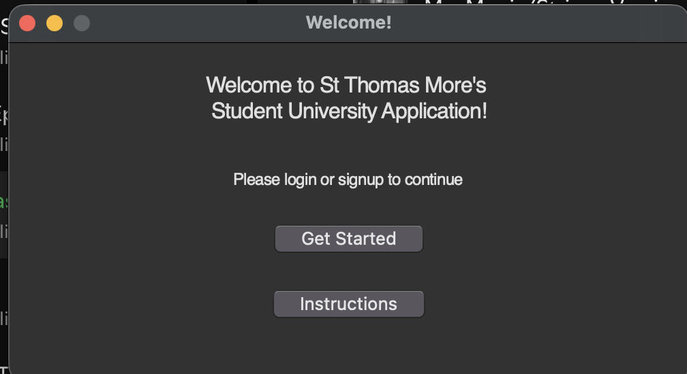
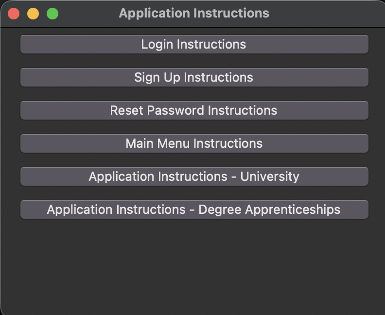
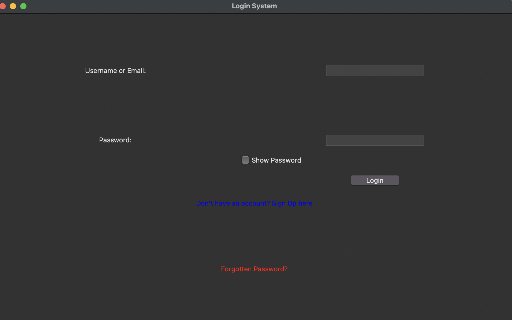
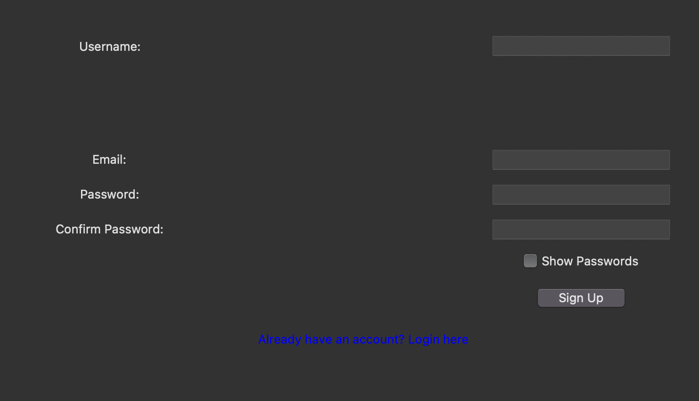

# Computer Science Non-Examined Assessment 2025
OCR A Level Computer Science H446 Coursework - 53/70
This was graded B, 3 marks away fom A

Requirements:
Python 3.12.x (otherwise tkinter won't work)

Then, just run the python program.

When you run the program, it should "Welcome you":

By clicking Instructions, you get this:

These all detail on how to use the program.

Pressing "Get Started" leads to this:

As such, you will need to sign up:

And by signing up, you will need to return to the login page where you can pick the degree apprenticeship or university you want to apply to.

When you sign up, the password is automatically hashed and salted using SHA256 so if you were to look at users.db, then it would show a different result.